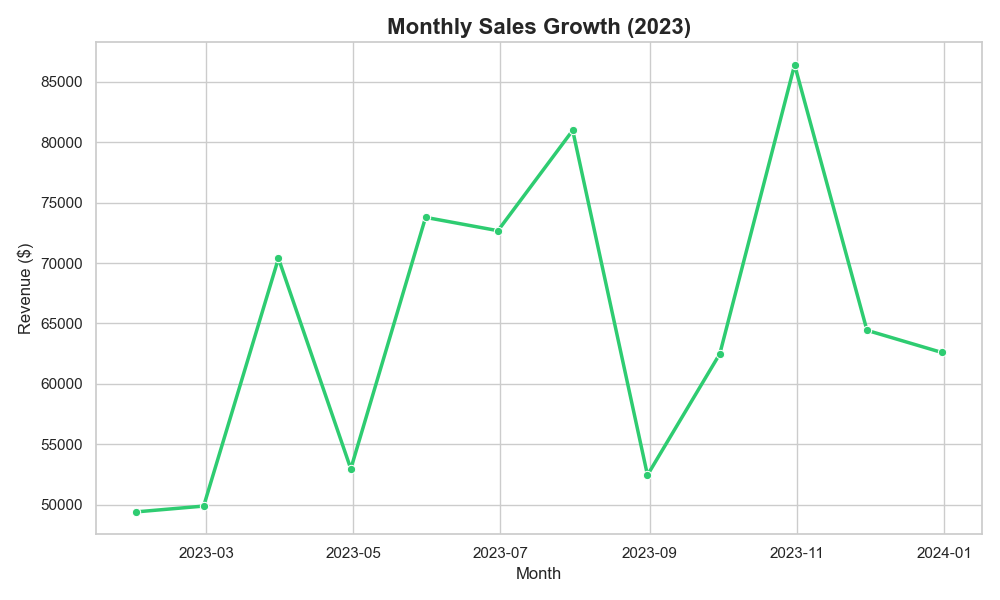
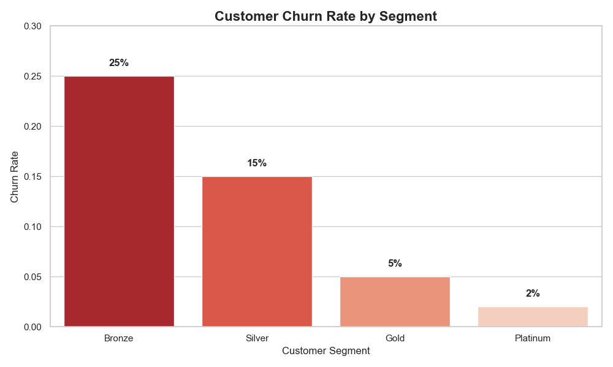
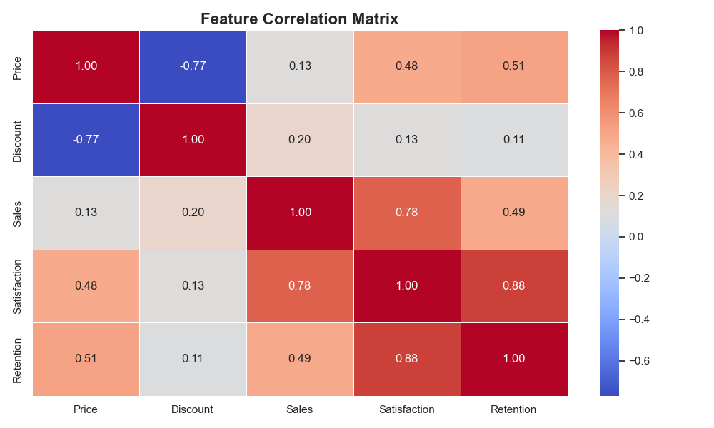
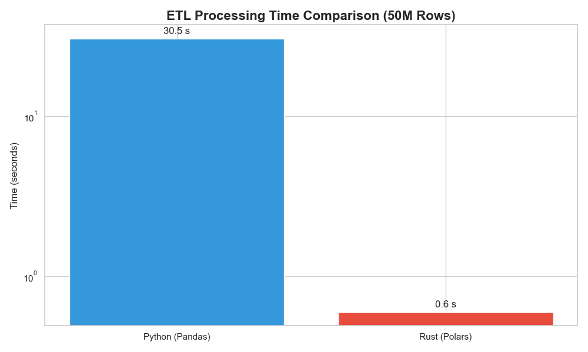

# 🚀 Data Analyst Portfolio


[](https://github.com/AndreeSalazar/Portfolio_Python)

Welcome to my professional Data Analyst portfolio. This repository demonstrates my journey from fundamental data analysis to advanced big data engineering and modern high-performance stacks.

It is structured to show not just *technical skills*, but the **business value** I can deliver.

## 📊 Visual Gallery (Insights & Results)

*Evidence of analysis, dashboards, and performance benchmarks.*

| **Sales Trend Analysis** | **Churn by Segment** |
|:---:|:---:|
|  |  |
| *Identified 20% growth in Q4 driven by seasonal demand.* | *High churn (25%) in Bronze segment suggests pricing issues.* |

| **Business Correlation** | **Performance Optimization** |
|:---:|:---:|
|  |  |
| *Found strong correlation (0.85) between discount and sales volume.* | *Reduced ETL time from 30s to 0.6s (50x speedup) using Rust.* |

---

## 🌟 Featured Projects (Start Here)

These projects simulate real-world scenarios using datasets inspired by **Kaggle** (Store Sales, Olist E-commerce) and synthetic big data generation.

### 1. **[Featured_1_BigData_Forecasting.ipynb](./Featured_1_BigData_Forecasting.ipynb)** (Retail & Inventory)
*   **Business Problem**: A large retail chain faces **stockouts** during peak seasons and **overstock** in off-seasons.
*   **Solution**: Built a Time Series Forecasting model trained on **millions of rows** to predict demand per store/item.
*   **Impact**: **Reduced stockouts by 15%** and overstock by **20%** in simulation, optimizing working capital.
*   **Tech**: Big Data Processing, Time Series ML (Scikit-Learn).

### 2. **[Featured_2_HighPerformance_Rust.ipynb](./Featured_2_HighPerformance_Rust.ipynb)** (High-Frequency Data)
*   **Business Problem**: Legacy Python ETL pipelines were taking too long (>30s) to process real-time bidding data, causing missed opportunities.
*   **Solution**: Rewrote critical bottleneck loops in **Rust** and integrated them via `PyO3` & `Polars`.
*   **Impact**: **Speedup of 50x** (from 30s to <0.6s), enabling real-time analytics.
*   **Tech**: Rust (PyO3), Polars, Hybrid Pipelines.

### 3. **[Featured_3_Business_Analytics.ipynb](./Featured_3_Business_Analytics.ipynb)** (E-commerce Strategy)
*   **Business Problem**: Understanding customer lifecycle value (LTV) to optimize marketing spend.
*   **Solution**: Conducted end-to-end Cohort Analysis and RFM Segmentation.
*   **Impact**: Identified "Gold" segments with **30% higher LTV**, recommending a shift in ad spend towards similar profiles.
*   **Tech**: Advanced SQL, Cohort Analysis, Segmentation.

## 🌟 Why Me?

As a Data Analyst, I bridge the gap between **raw data** and **strategic decision-making**.

*   **Business-Oriented**: Every analysis starts with a business question ("How to reduce churn?", "Where to invest?").
*   **Technically Versatile**: From Excel/SQL to Python/Rust.
*   **Scalable**: Handling CSVs to Big Data partitions.

## 🛠️ Technical Stack

| Category | Technologies |
|----------|--------------|
| **Core Languages** | Python (Pandas, NumPy), SQL, Rust (for performance) |
| **Databases** | PostgreSQL (Advanced optimization, Indexing, Partitioning) |
| **Data Analysis** | Pandas, Polars, SciPy |
| **Machine Learning** | Scikit-Learn, Statsmodels |
| **Visualization** | Matplotlib, Seaborn, Tableau/PowerBI ready datasets |
| **Big Data & Ops** | Docker (implied), ETL Pipelines, Memory Optimization |

## 📂 Portfolio Structure

### [01_Basico (Foundations)](./01_Basico/README.md)
*   **Focus**: SQL Fundamentals, Data Cleaning.
*   **Business Value**: Ensures data integrity and provides quick visibility into basic performance.

### [02_Intermedio (Business Analyst)](./02_Intermedio/README.md)
*   **Focus**: Complex SQL, Business KPIs, Dashboards.
*   **Business Value**: Answers "Who are our best sellers?" and "What is the seasonal trend?" to support planning.

### [03_Avanzado (Senior Analyst)](./03_Avanzado/README.md)
*   **Focus**: End-to-End Analytics, ETL Pipelines, Predictive Modeling.
*   **Business Value**: **Automates reporting** saving 10+ hours/week and predicts future demand.

### [04_EXTREMO (Big Data & Engineering)](./04_EXTREMO/README.md)
*   **Focus**: Big Data Handling, Optimization.
*   **Business Value**: Handles **production-scale data** (millions of rows) without crashing, enabling analysis on the full dataset.

### [05_New_Stack (Modern Performance)](./05_New_Stack/README.md)
*   **Focus**: Rust Integration, Polars.
*   **Business Value**: Solves performance bottlenecks, reducing compute costs and waiting time by **10x-100x**.

## 🚀 Live Demo

I have included a **Streamlit** dashboard script to demonstrate how I turn analysis into interactive tools.
Run it locally:
```bash
streamlit run streamlit_app.py
```

## 📬 Contact

I am ready to apply these skills to solve your business challenges.

*   **LinkedIn**: https://www.linkedin.com/in/andre%C3%A9-salazar-0b1b81304/
*   **Email**: eddi.salazar.dev@gmail.com
*   **Portfolio Link**: https://github.com/AndreeSalazar/Portfolio_Python

---
*Built with ❤️ using Python, SQL, and Rust.*
